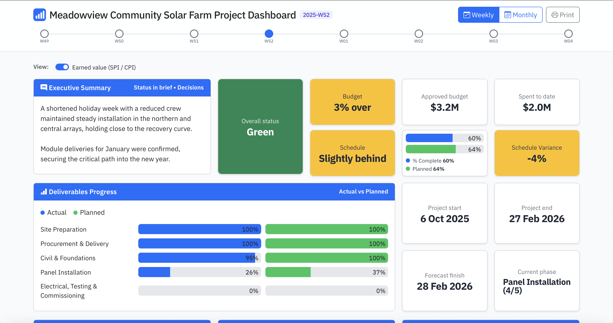
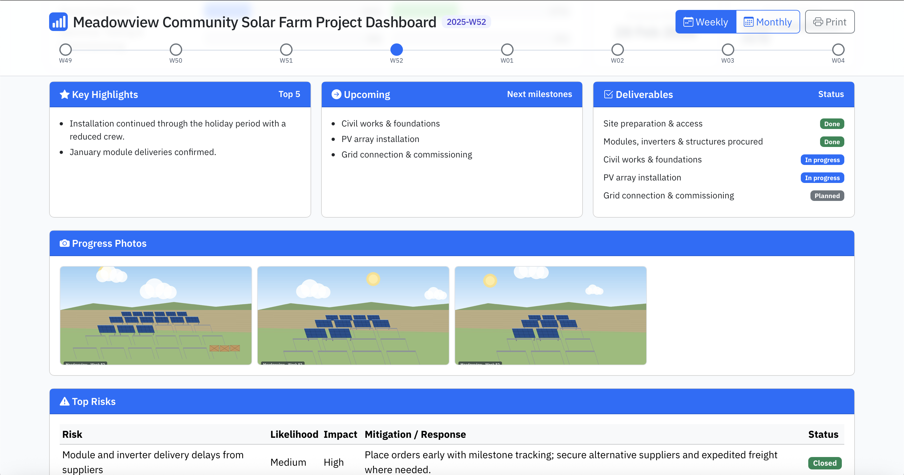
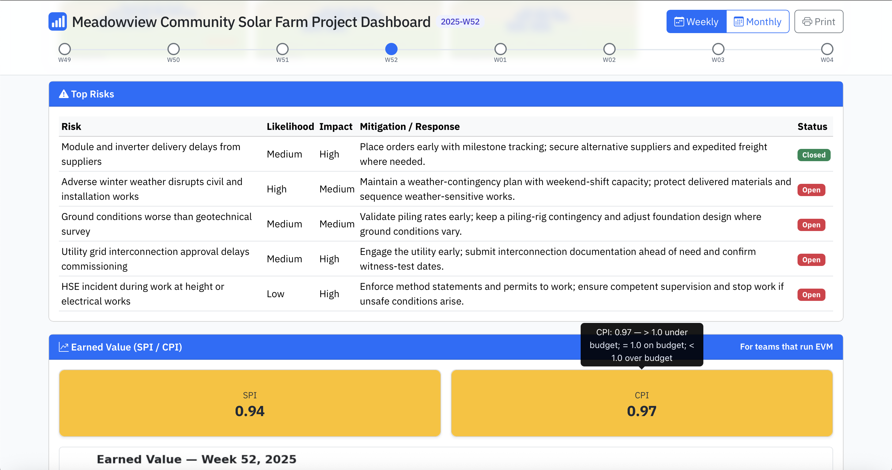
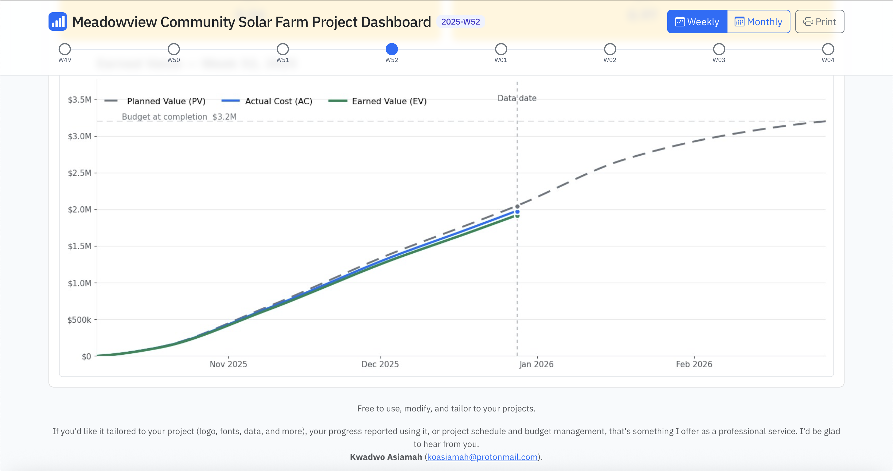

# Executive Project Dashboard

A lightweight, brandable project dashboard built with **Bootstrap 5** and **vanilla JavaScript**. It presents a project’s **weekly and monthly progression** with an executive summary, RAG status, plain-language Schedule and Budget health, key dates, KPIs (Actual / Planned / Variance), highlights, deliverables, risks, and progress photos.

Earned Value (SPI / CPI and an S-curve image) and a Kanban board ship as **optional modules** — switched off by default and revealed with a toggle — so teams that don’t use Earned Value aren’t forced to show it.

The dashboard is intentionally **static**: it runs on any static web host (or opens directly in a browser) and is maintained through a small JSON block and an image folder.

It ships with a fully fictional sample — the **Meadowview Community Solar Farm** — covering both weekly and monthly reporting periods, complete with Earned Value charts and progress photos, so you can see every feature in action before adding your own data.









---

## ✨ Highlights

* **Exec-ready one-pager** with a sticky header and responsive layout.
* **Weekly & monthly progression**, with the **latest period auto-selected** by default in each view.
* **No charting libraries** — visuals are tiles, CSS bars, and images for maximum portability.
* **Brandable** — swap the header mark, colours, and typeface to match your own identity.
* **Optional modules** — Earned Value (SPI/CPI + chart) and a Kanban board toggle on or off, keeping the default view executive-friendly.
* **Derived automatically** — the current phase, deliverable statuses, and the “Upcoming” list are all calculated from a single percentage, so there is less to keep in sync by hand.

> **Note on connectivity:** the dashboard loads Bootstrap, Bootstrap Icons, and the IBM Plex Sans web font from CDNs, so an internet connection is needed for full styling. Opened fully offline it still works and degrades gracefully to system fonts.

---

## 🗂 Folder & File Layout

```
/assets
  /photos/
    /2026-W04/            # one folder per reporting period
      1.jpg               # progress photos (1..24, landscape recommended)
      2.jpg
      3.jpg
      earned-value.jpg    # Earned Value chart for this period
    /2026-02/
      1.jpg
      ...
      earned-value.jpg
index.html                # the dashboard
periodJSON-builder.html   # helper to build period JSON entries
README.md
```

**Paths used by the template (relative to the dashboard HTML file):**

* **Typography** — IBM Plex Sans, loaded from Google Fonts (no local font files).
* **Earned Value chart** — `assets/photos/<period>/earned-value.jpg`
* **Progress photos** — `assets/photos/<period>/<n>.(jpg|jpeg|png|webp)`

---

## 🚀 Quick Start

1. Place the dashboard HTML file and the `assets/` folder together as shown above.
2. Open the HTML file in a modern browser, or host it on any static server.
3. Use the **Weekly / Monthly** toggle in the header. Each view defaults to its **latest** period.

**Deep link format** — use a hash to jump straight to any period:

* Weekly: `#week|2026-W04`
* Monthly: `#month|2026-02`

---

## 🎨 Branding

* **Header mark & favicon:** both are inline SVGs in the HTML — edit the `<svg>` in the header and the `data:image/svg+xml,...` favicon in the `<head>`, or replace them with your own logo.
* **Colours:** the dashboard uses Bootstrap utility colours plus a primary blue (`#0d6efd`). Adjust in the `<style>` block.
* **Typeface:** IBM Plex Sans is pulled in via a Google Fonts `<link>` in the `<head>` and referenced through the `--font-sans` CSS variable. Change the `<link>` and the variable to use a different font, or self-host if you need a fully offline build.

---

## 🧩 Data Model (where to edit content)

Your data lives in two places inside `<script>`:

### 1) Period lists

```js
const sample = {
  weeks:  ["2025-W49","2025-W50","2025-W51","2025-W52","2026-W01","2026-W02","2026-W03","2026-W04"],
  months: ["2025-10","2025-11","2025-12","2026-01","2026-02"],
  periods: {}
};
```

* These arrays drive the timeline and the “latest” selection in each view.
* Add or remove period IDs as needed. Leave `months` empty (`[]`) to disable the Monthly view.

### 2) `periodJSON` entries (per period)

```js
const periodJSON = {
  "2026-W04": {
    narrative: {
      summary: "Installation neared completion; focus shifted to electrical termination and pre-commissioning checks.",
      wins: ["Inverters energised in the northern array for initial testing.", "Pre-commissioning checks commenced."],
      asks: ["None."],
      escalations: ["None."]
    },
    rag: "Green",                 // "Red" | "Amber" | "Green"
    projectEnd: "27 Feb 2026",    // Baseline finish — change only on a re-baseline
    forecastFinish: "27 Feb 2026",// Where the project is now expected to finish
    actualPct: 79,                // % complete (Actual)
    plannedPct: 82,               // % complete (Planned)
    activities: [                 // Activities bar chart (Actual vs Planned)
      { name: "Panel Installation", actual: 77, planned: 84 },
      { name: "Electrical, Testing & Commissioning", actual: 0, planned: 0 }
    ],
    spi: 0.96,                    // Schedule Performance Index — must equal actualPct / plannedPct
    cpi: 1.00,                    // Cost Performance Index — also drives "Spent to date"
    risks: [                      // Risks table
      { risk: "Adverse winter weather disrupts works", likelihood: "High", impact: "Medium",
        mitigation: "Maintain a weather-contingency plan with weekend-shift capacity.", status: "Open" }
    ]
  }
};
```

**Baseline vs forecast finish.** `projectEnd` is the *agreed* finish date and `forecastFinish` is where the project is currently heading; the gap between them is the story the dashboard tells. Both live inside each period rather than at project level, because a schedule can be formally re-baselined partway through — when that happens, change `projectEnd` from that period onward and leave earlier periods untouched, so the history still shows what was agreed at the time. If you omit `projectEnd`, the dashboard falls back to that period's `forecastFinish`.

**Narrative fields.** `summary` appears in the Executive Summary card and `wins` feeds **Key Highlights** (top 5). `asks` and `escalations` render beneath as labelled lists, and any entry reading “None” is dropped automatically — so you can leave the placeholders in place without cluttering the card. There is no `narrative.risks` field: project risks belong in the top-level `risks` array, which drives the Top Risks table.

**Keep SPI and the percentages in step.** SPI is Earned Value ÷ Planned Value, which with percent-complete figures is simply `actualPct / plannedPct`. Setting SPI by hand to a value that doesn’t match will make the SPI tile disagree with the Actual/Planned tiles and with your earned-value chart. The builder has a **Calculate** link beside the SPI box that fills this in for you.

**Keep weekly and monthly in step too.** The two views describe the same project at different granularity, so a month-end figure should sit between the weekly figures either side of it. If December’s weekly periods reach 60%, the December month figure cannot be 47%.

**To update the dashboard content:**

* Use `periodJSON-builder.html` to build period entries, then paste them into the `periodJSON` block.
* Add the matching period IDs to the `weeks` and `months` arrays in the `sample` block.

---

## 🧭 Project Phases & Deliverables (`PHASES` and `DELIVERABLES`)

In the `<script>` block sit two small arrays that describe the *shape* of your project. Both work off a single number — the period’s `actualPct` — so once they are set up, the **Current phase** tile, the **Deliverables** card, and the **Upcoming** card all keep themselves up to date.

### `PHASES` — what stage the project is in

```js
const PHASES = [
  { name: 'Site Preparation',            t: 0  },
  { name: 'Procurement & Delivery',      t: 10 },
  { name: 'Civil & Foundations',         t: 25 },
  { name: 'Panel Installation',          t: 45 },
  { name: 'Electrical & Commissioning',  t: 82 }
];
```

`t` is the **overall % complete at which that phase starts**. Think of the numbers as signposts along a 0–100 road: whichever signpost you passed most recently tells you where you are. You never write the end of a phase — it ends where the next one begins.

| % complete | Phase shown |
| ---------- | ----------- |
| 0–9        | Site Preparation |
| 10–24      | Procurement & Delivery |
| 25–44      | Civil & Foundations |
| 45–81      | Panel Installation |
| 82–100     | Electrical & Commissioning |

**To adapt it to your project:** rename the phases and set each `t` to the percentage at which that phase begins. Keep the list in ascending order, and start the first phase at `0`. To make a phase shorter, lower the `t` of the phase *after* it — that one change moves the boundary they share.

### `DELIVERABLES` — what’s done, in progress, and still to come

```js
const DELIVERABLES = [
  { name: 'Site preparation & access',                start: 0,  done: 10  },
  { name: 'Modules, inverters & structures procured', start: 5,  done: 40  },
  { name: 'Civil works & foundations',                start: 20, done: 62  },
  { name: 'PV array installation',                    start: 45, done: 88  },
  { name: 'Grid connection & commissioning',          start: 80, done: 100 }
];
```

Each deliverable gets a **window** on the same 0–100 scale: `start` is the overall % at which work on it begins, `done` the overall % by which it is finished. The status is then worked out by comparing the period’s % complete against that window:

* at or past `done` → **Done**
* past `start` but not yet `done` → **In progress**
* not yet at `start` → **Planned**

At 79% complete, for example, the first three items read Done, *PV array installation* (45 → 88) reads In progress, and *Grid connection & commissioning* (80 → 100) is still Planned.

Windows are **allowed to overlap** — procurement starting at 5 while site preparation runs to 10 is exactly how parallel workstreams show up, and it means several items can sensibly be In progress at once. The **Upcoming** card simply lists the next few deliverables that aren’t Done yet, so it needs no separate maintenance.

**A good rule of thumb:** set `done` for your last deliverable to `100`, and make sure every stretch of the 0–100 range is covered by at least one deliverable, or the Deliverables card will look sparse in the middle of the project.

---

## 📊 What each section shows

* **Executive Summary** — the period’s narrative summary, followed by Decisions needed and Escalations.
* **Overall Status** — Overall status (RAG).
* **Budget** — plain-language Budget health, Approved budget, and Spent to date (calculated from % complete and CPI).
* **Schedule** — plain-language Schedule health, plus **% Complete**, **Planned % Complete**, and **% Variance (Actual − Planned)**.
* **Deliverables Progress** — pure-CSS dual bars (Actual vs Planned) with in-bar labels.
* **Dates** — Project start, Project end, and Forecast finish.
* **Current phase** — derived from `PHASES` (see above).
* **Key Highlights / Upcoming / Deliverables** — wins from the narrative, and the next and current deliverables derived from `DELIVERABLES`.
* **Progress Photos** — thumbnail grid that opens into a modal carousel.
* **Top Risks** — a simple table with status badges.
* **Earned Value (optional module)** — SPI / CPI tiles plus `assets/photos/<period>/earned-value.jpg`.

Earned Value (optional module) is hidden by default and revealed with the toggle at the top of the page.

**Tooltips.** Every tile's tooltip repeats its label and its value (for example, *Overall status: Green*), so a value that is shortened on screen can still be read in full on hover. The Current phase tile clamps long phase names to two lines with an ellipsis for this reason — rename a phase as long as you like and the tile will stay tidy.

**A note on colour.** Schedule health, the Variance tile, and the SPI tile all read from one set of thresholds, and Budget health matches the CPI tile — so a given label always carries the same colour in every reporting period.

| | Green | Amber | Red |
| --- | --- | --- | --- |
| **SPI** (schedule) | ≥ 0.95 — *On track* | 0.90–0.94 — *Slightly behind* | < 0.90 — *Behind* |
| **CPI** (budget) | ≥ 1.00 | 0.95–0.99 | < 0.95 |

Schedule allows a 5% tolerance before it stops being green, which is common practice — a project a few percent behind plan is not usually “off track”. Cost is held to a tighter line. To change either, edit `SPI_BANDS` in the `script` block (schedule) or `budgetHealth` (cost).

Two things worth knowing about SPI. It is a **ratio**, so it is jumpy very early in a project — being 3 points behind reads as 0.70 in week two but 0.97 in month five, for the same slippage. And Overall status (RAG) is set by you in `periodJSON` and is deliberately independent, so a project can be behind on one measure while the manager’s overall call is still Green.

---

## 📷 Progress Photos

The template looks for files named `1`–`24` with extensions `.jpg`, `.jpeg`, `.png`, or `.webp` inside each period’s folder, e.g. `assets/photos/2026-W04/1.jpg`.

**Orientation:** use **landscape** images (width greater than height) for the best results in the thumbnail grid and the full-screen carousel.

---

## 🧪 Adding a new weekly period (example)

1. Add an ID — say `2026-W05` — to the `weeks` array in the `sample` block:

```js
const sample = {
  weeks: ["2026-W04", "2026-W05"],
  months: [],
  periods: {}
};
```

2. Add a matching object in `periodJSON`:

```js
const periodJSON = {
  "2026-W05": {
    narrative: {
      summary: "Grid connection achieved; commissioning testing underway.",
      wins: ["First export recorded during initial performance tests."],
      asks: ["None."],
      escalations: ["None."]
    },
    rag: "Green",
    projectEnd: "27 Feb 2026",
    forecastFinish: "27 Feb 2026",
    actualPct: 88,
    plannedPct: 90,
    activities: [
      { name: "Panel Installation", actual: 100, planned: 100 },
      { name: "Electrical, Testing & Commissioning", actual: 40, planned: 55 }
    ],
    spi: 0.98,
    cpi: 1.00,
    risks: [
      { risk: "Utility grid interconnection approval delays commissioning", likelihood: "Medium", impact: "High",
        mitigation: "Engage the utility early; confirm witness-test dates.", status: "Open" }
    ]
  }
};
```

3. Add images (optional):

```
assets/photos/2026-W05/earned-value.jpg
assets/photos/2026-W05/1.jpg
assets/photos/2026-W05/2.jpg
```

Reload the page. The Weekly view auto-selects **2026-W05** if it’s the latest.

---

## 📄 License

MIT. Free to use, modify, and tailor to your projects.

Third-party assets keep their own licenses: **Bootstrap** and **Bootstrap Icons** (MIT) and **IBM Plex Sans** (SIL Open Font License 1.1).

---

## 📫 Contact

If you'd like it tailored to your project (logo, fonts, data, and more), your progress reported using it, or project schedule and budget management, that's something I offer as a professional service. I'd be glad to hear from you.

**Kwadwo Asiamah** ([koasiamah@protonmail.com](mailto:koasiamah@protonmail.com)).
